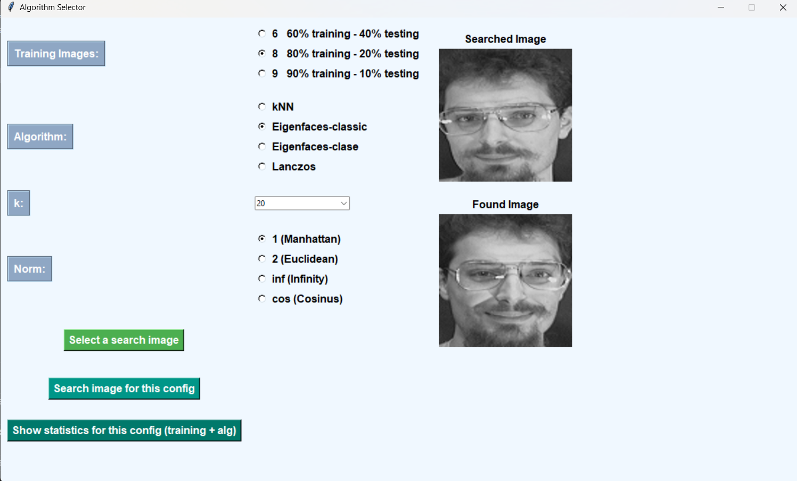
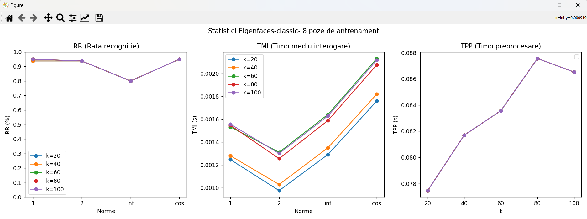

# Image-Recognition-System-with-Multiple-Algorithms
This application is a Python-based GUI designed to facilitate image search and comparison through different algorithms. Users can select a specific algorithm, configure the number of training images, and choose a norm for calculating distances between images. The app allows users to search for the most similar image to a selected query image and displays the results, making it useful for tasks such as facial recognition, image retrieval, and pattern recognition.

## Features

- *Algorithm Selection*: Choose from various algorithms such as:
  - *k-Nearest Neighbors (kNN)*: A classification algorithm that finds the closest images based on distance metrics.
  - *Eigenfaces (Classic)*: A method for face recognition based on Principal Component Analysis (PCA).
  - *Eigenfaces (Class-based)*: A variant of Eigenfaces that groups images by classes for better recognition.
  - *Lanczos Resampling*: A high-quality resampling algorithm used for image resizing, also used here for image comparison tasks.
  
- *Configurable Training Data*: Select from multiple training image configurations, allowing you to adjust the balance between training and testing datasets.
  - Options: 60% training - 40% testing, 80% training - 20% testing, 90% training - 10% testing.

- *Norm Selection*: Choose from different distance norms to measure similarity:
  - *Manhattan Distance* (L1 norm)
  - *Euclidean Distance* (L2 norm)
  - *Infinity Norm*
  - *Cosine Similarity*
  
- *Search Image*: Choose an image from your local file system to search for the most similar image based on the selected configuration.

- *Image Display*: View the query image and the most similar image found by the selected algorithm, all within the GUI.

- *Error Handling*: The application provides clear error messages when necessary configurations are not selected (e.g., missing algorithm, missing training images, etc.).

## Requirements

To run the application, you need the following dependencies:

- Python 3.x
- Tkinter (for the GUI)
- Pillow (for image processing)
- subprocess (to run external Python scripts)
- Ensure the algorithm scripts are in the correct paths

### Python Packages:

You can install the required Python packages via pip:

bash
pip install tk pillow

### Algorithm Scripts

The application relies on several Python scripts for the actual image processing and algorithmic operations. These scripts must be present in their respective directories on your local machine. Below is the list of the required scripts along with their expected file paths:

- kNN.py: Implements the k-Nearest Neighbors algorithm.
- Eigenfaces-clase.py: Implements the Eigenfaces algorithm (Class-based).
- Eigenfaces-classic.py: Implements the classic Eigenfaces algorithm.
- Lanczos.py: Implements the Lanczos resampling algorithm.

Make sure these scripts are placed correctly in your local directory structure. The application uses the following paths to locate these scripts:

- C:\Users\win\OneDrive\Desktop\GUI\kNN\kNN.py
- C:\Users\win\OneDrive\Desktop\GUI\Eigenfaces_clase\Eigenfaces-clase.py
- C:\Users\win\OneDrive\Desktop\GUI\Eigenfaces_classic\Eigenfaces-classic.py
- C:\Users\win\OneDrive\Desktop\GUI\Lanczos\Lanczos.py

Alternatively, you can modify the paths in the code to match the locations of your scripts on your system.

### Configuring the Scripts

Each algorithm script is designed to process the image dataset and perform a specific image recognition task. Ensure that the paths to these scripts are correctly referenced in the main application code. The script mappings are typically set up in the application initialization section or a configuration file.

In case you're running the application from a different environment or system setup, ensure the paths to these algorithms are updated and accessible. Here is a sample script mapping configuration:

python
script_mapping = {
    'kNN': r'C:\Users\win\OneDrive\Desktop\GUI\kNN\kNN.py',
    'Eigenfaces-clase': r'C:\Users\win\OneDrive\Desktop\GUI\Eigenfaces_clase\Eigenfaces-clase.py',
    'Eigenfaces-classic': r'C:\Users\win\OneDrive\Desktop\GUI\Eigenfaces_classic\Eigenfaces-classic.py',
    'Lanczos': r'C:\Users\win\OneDrive\Desktop\GUI\Lanczos\Lanczos.py'
}

### Installation

Follow these steps to get the application up and running:

 1.Clone the repository to your local machine:

  bash
  git clone <repository-url>
  cd <repository-folder>

2. Install dependencies:

bash
pip install tk pillow

3.Ensure algorithm scripts are in place: The application expects certain Python scripts (e.g., kNN.py, Eigenfaces.py) to be available in the following paths:

- C:\Users\win\OneDrive\Desktop\GUI\kNN\kNN.py
- C:\Users\win\OneDrive\Desktop\GUI\Eigenfaces_clase\Eigenfaces-clase.py
- C:\Users\win\OneDrive\Desktop\GUI\Eigenfaces_classic\Eigenfaces-classic.py
- C:\Users\win\OneDrive\Desktop\GUI\Lanczos\Lanczos.py

Make sure these scripts are available in the paths defined in the script_mapping section of the code.

4.Run the application: To launch the GUI, execute the following command:

bash
python GUI.py

### Training Data 
The training data for this project can be found in the att_faces folder. After extracting the file, make sure to update the paths in the code to reflect the location of the extracted images. The training images should be placed in the correct directory, and the application will use them for the image recognition tasks. Modify the paths in each of the algorithm scripts (kNN.py, Eigenfaces-clase.py, Eigenfaces-classic.py, Lanczos.py) to reflect the new location of the training data.

For example, if the extracted data is in the directory C:\Users\win\OneDrive\Desktop\GUI\att_faces, ensure the paths in the code reflect this location.

### Screenshots

Here are some screenshots of the application in action:

1. *Image Search Results:*
   

2. *Graphical Results:*
   

### License
This project is licensed under the MIT License - see the LICENSE file for details.
